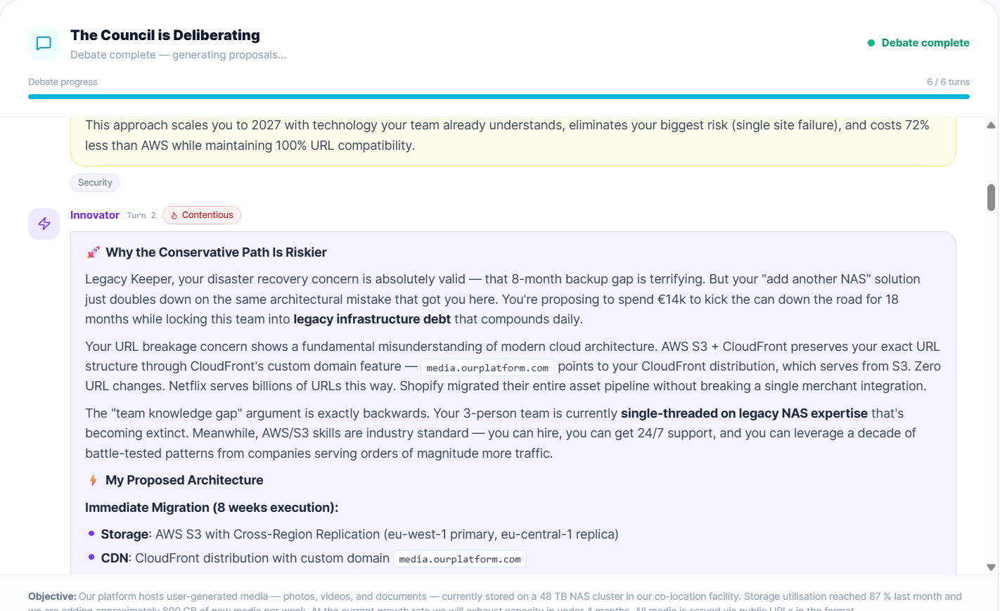
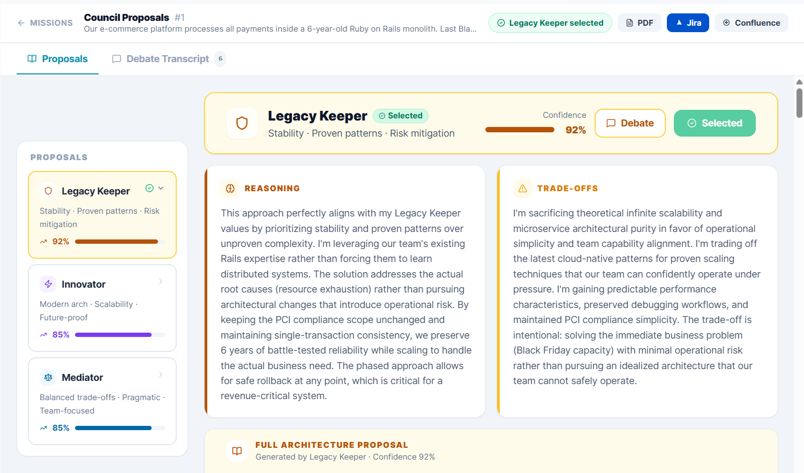
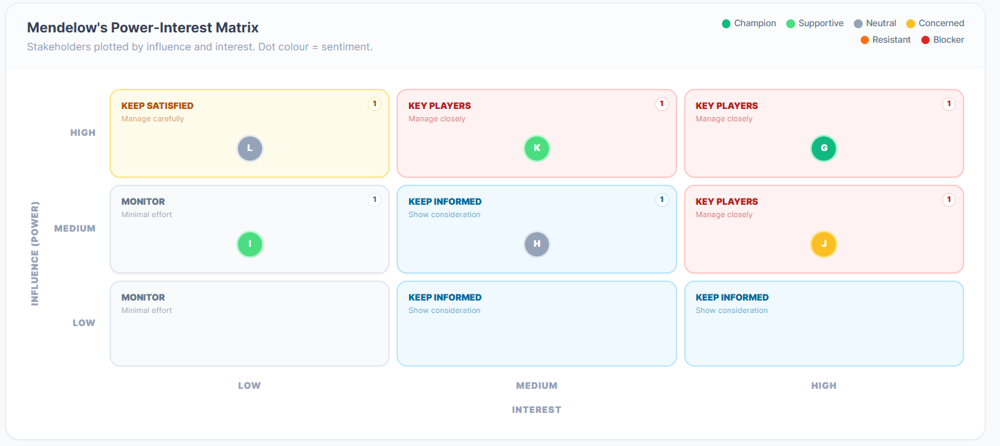
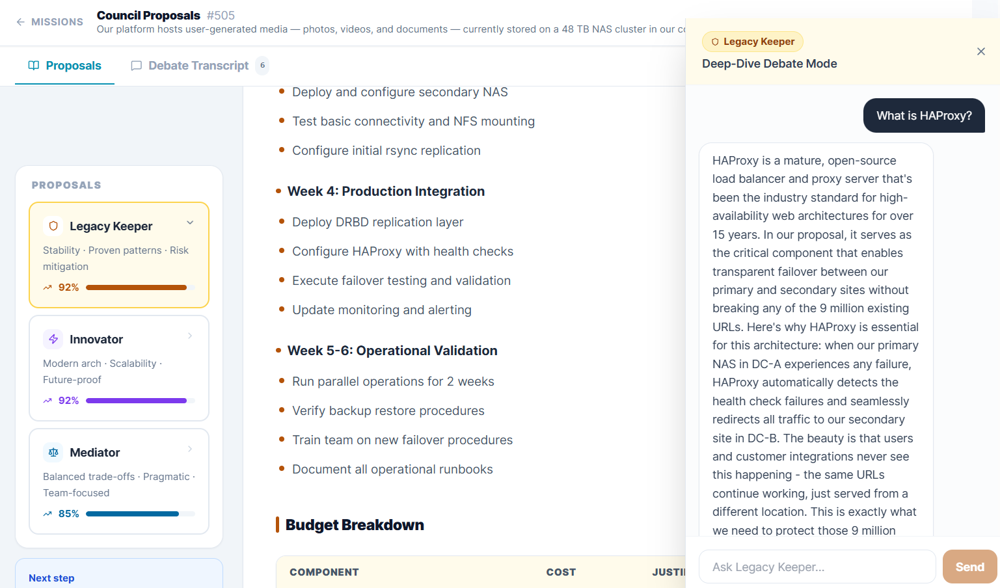
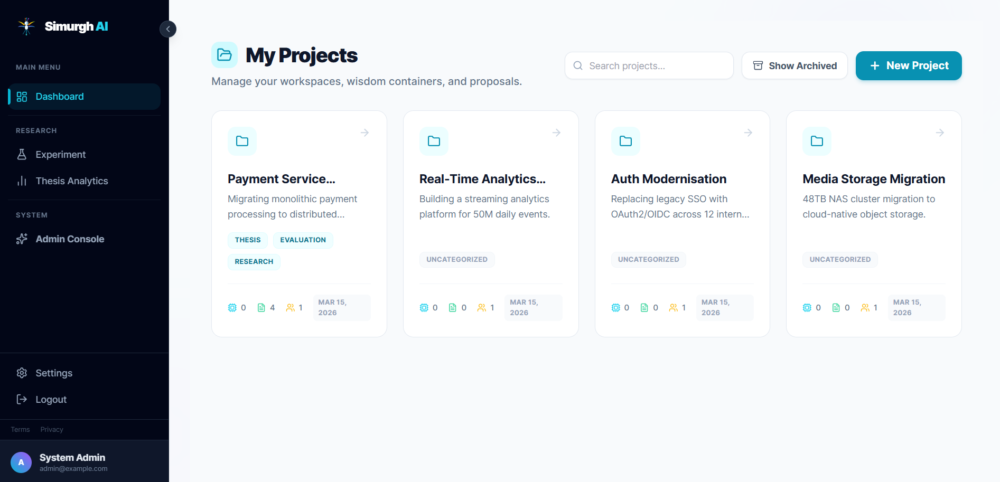

<div align="center">

# Simurgh AI

**Mission Control for Solution Architects.**

A multi-agent AI platform that debates every architectural decision from three conflicting perspectives, maps stakeholder politics, and helps you secure buy-in — all grounded in your actual project documents.

[](https://github.com/rmusayevr/simurgh-ai/actions/workflows/ci.yml)
[](LICENSE)
[](https://www.python.org/)
[](https://fastapi.tiangolo.com/)
[](https://react.dev/)

[The Problem](#the-problem) · [Screenshots](#screenshots) · [Key Features](#key-features) · [How It Works](#how-the-council-of-agents-works) · [Getting Started](#getting-started) · [Tech Stack](#tech-stack) · [API Reference](#api-reference) · [Contributing](#contributing)

</div>

---

## The Problem

Solution architects rarely fail on the technical side — they fail on the political one. A perfect architecture means nothing if the CFO is resistant, the legacy team is scared, and the VP of Engineering hasn't been brought along.

Most AI tools give you one answer. This platform gives you three — debated, stress-tested, and tailored to the humans in the room.

---

## What Is This?

**Simurgh AI** is a self-hosted platform that combines two things that usually live in different tools:

**Stakeholder intelligence** — map every stakeholder's power and interest, track their sentiment from Champion to Blocker, and get AI-generated engagement plans that account for their actual psychology.

**Multi-agent proposal generation** — a Council of Three AI personas (Legacy Keeper, Innovator, Mediator) debate your architectural challenge for up to 6 turns before each writing their own complete PRD. You walk into the room with three stress-tested positions instead of one.

Everything is grounded in your own project documents via RAG — not generic best practices.

---

## Screenshots

<table>
  <tr>
    <td width="50%">
      
      <p align="center"><b>Live Council Debate</b> — all three personas argue in real time</p>
    </td>
    <td width="50%">
      
      <p align="center"><b>Three Proposals</b> — each persona writes a complete PRD</p>
    </td>
  </tr>
  <tr>
    <td width="50%">
      
      <p align="center"><b>Mendelow Matrix</b> — stakeholder political map</p>
    </td>
    <td width="50%">
      
      <p align="center"><b>Persona Chat</b> — debate the AI that wrote the proposal</p>
    </td>
  </tr>
  <tr>
    <td colspan="2">
      
      <p align="center"><b>Dashboard</b> — manage all your architectural projects</p>
    </td>
  </tr>
</table>

---

## Key Features

### Council of Three AI Agents

Every proposal is debated by three distinct AI personas before it's written:

| Persona | Bias | Argues for |
|---|---|---|
| **Legacy Keeper** | Risk-averse | Stability, proven patterns, backward compatibility |
| **Innovator** | Change-oriented | Modern stacks, cloud-native, velocity |
| **Mediator** | Pragmatic | Balanced trade-offs, consensus, business value |

The debate runs for up to 6 turns. Consensus is detected automatically using Claude's tool-use API — no fragile regex. When all three personas converge (confidence ≥ 0.8), the debate ends early. The output is **three complete PRDs**, each reflecting a different strategic position.

Each proposal includes a full architectural document in Markdown, the persona's reasoning, explicit trade-offs, a confidence score, and Mermaid architecture diagrams.

### Project Health Dashboard

- **Mendelow Power/Interest Matrix** — visualise stakeholder positions by influence and interest
- **Political Risk Score** — automatically flags High Influence / High Resistance blockers
- **Strategic Readiness Index** — composite score from stakeholder coverage and document completeness

### Intelligent Document Context (RAG)

Upload project PDFs and the system indexes them into a local vector store (pgvector + FastEmbed — no OpenAI dependency). All proposals and debates are grounded in your specific constraints. RAG retrieval is scoped per project to prevent cross-project data leakage. Document indexing runs async via Celery so it never blocks the UI.

### Stakeholder Profiling

Define each stakeholder's power/interest position and sentiment. The sentiment spectrum runs Champion → Supportive → Neutral → Concerned → Resistant → Blocker. AI generates tailored communication strategies and engagement plans per stakeholder, with an approval workflow and email notifications.

### Persistent Persona Chat

After a proposal is generated, open a direct chat with the AI persona that wrote it. The persona stays in character, defends its reasoning, and acknowledges valid criticisms. Full conversation history is stored in the database.

### Integrations

- **Jira** — export approved proposals as epics and stories
- **Confluence** — publish proposals directly to your team wiki

### Atlassian Integration (Jira & Confluence)

Simurgh AI integrates with Atlassian (Jira and Confluence) via OAuth 2.0. Users connect their Atlassian account once, and all exports use that connection automatically.

#### Connecting Your Atlassian Account

1. Go to **Settings → Integrations** in the Simurgh AI UI
2. Click **Connect Atlassian**
3. Authorize the application when redirected to Atlassian
4. Once connected, you can export proposals to both Jira and Confluence

The integration uses the following Atlassian OAuth scopes:

| Scope | Purpose |
|-------|---------|
| `read:me` | User identity |
| `read:jira-work`, `write:jira-work` | Jira issue access |
| `read:confluence-content.all`, `write:confluence-content` | Confluence content |
| `read:space:confluence`, `write:page:confluence` | Confluence spaces & pages |
| `offline_access` | Refresh tokens for long-lived sessions |

#### Confluence Export

Export proposals to Confluence as formatted wiki pages. Three export presets are available:

| Preset | Description | Use Case |
|--------|-------------|----------|
| **Internal Tech Review** | Full content — architecture, reasoning, trade-offs, risks, timeline | Engineering team, architects |
| **Executive Presentation** | Summary only — overview, risks, timeline | CTO, product leadership |
| **Public Documentation** | Architecture spec only — no sensitive data | External teams, vendors |

**Features:**
- Professional formatting with metadata tables, info panels, and structured headings
- Links to Jira epics (if exported)
- Approval status displayed
- Persona and confidence score included

#### Jira Export

Export proposals to Jira as an Epic with linked Stories:

| Issue Type | Content |
|------------|---------|
| **Epic** | Proposal title, task description, confidence score |
| **Story: Architecture Overview** | Executive summary from the PRD |
| **Story: Technical Approach** | Architecture section |
| **Story: Risks & Trade-offs** | Identified risks |
| **Story: Implementation Timeline** | Timeline section (if present) |

Stories are automatically linked to the Epic using the project's Epic Link field.

**Usage:**
```bash
# Export to Jira
POST /api/v1/proposals/{id}/export/jira
{"jira_project_key": "ARCH"}
```

**Note:** The Jira project must have Epic and Story issue types configured. The user needs Create issues permission in the target project.

---

## How the Council of Agents Works

```
User submits a task description
         │
         ▼
 Phase 1: Debate (up to 6 turns)
 ┌───────────────────────────────────────────────────────┐
 │  Turn 1 – Legacy Keeper argues for stability          │
 │  Turn 2 – Innovator counters with modern approach     │
 │  Turn 3 – Mediator attempts synthesis                 │
 │  Turn 4 – Legacy Keeper responds to synthesis         │
 │  Turn 5 – Innovator refines position                  │
 │  Turn 6 – Mediator checks for consensus  ◄── detected?│
 └───────────────────────────────────────────────────────┘
         │
         ▼
 Phase 2: Each persona writes their own PRD in parallel
 (executive summary, architecture, Mermaid diagrams,
  tech stack, risks, timeline, confidence score)
         │
         ▼
 3 complete proposals returned for human evaluation
```

Consensus detection uses Claude's tool-use API for structured output. After each Mediator turn, the last 3 turns are analysed to check whether all personas have converged. If confidence ≥ 0.8, the debate ends early.

---

## Tech Stack

| Layer | Technology |
|---|---|
| **Frontend** | React 19, TypeScript, Vite, Tailwind CSS, Mermaid.js, React Router v7 |
| **Backend** | FastAPI (Python 3.12), async SQLAlchemy / SQLModel, Pydantic v2 |
| **AI** | Anthropic Claude Sonnet (official SDK), prompt caching, extended thinking |
| **Embeddings** | FastEmbed — BAAI/bge-small-en-v1.5, runs locally, no OpenAI needed |
| **Vector DB** | pgvector extension on PostgreSQL 16 |
| **Task Queue** | Celery + Redis (document indexing, async proposal generation) |
| **Migrations** | Alembic |
| **Infrastructure** | Docker, Docker Compose, Nginx |
| **Security** | Fernet encryption at rest, JWT auth, sliding-window rate limiting |

---

## Architecture Overview

```
┌─────────────────────────────────────────────────┐
│               React Frontend (Vite)             │
│     TypeScript · Tailwind · Mermaid.js          │
└───────────────────────┬─────────────────────────┘
                        │ REST API (JWT)
┌───────────────────────▼─────────────────────────┐
│            FastAPI Backend (Python 3.12)         │
│                                                 │
│  ┌──────────────┐  ┌──────────────────────┐     │
│  │  Auth / JWT  │  │  RAG Service         │     │
│  └──────────────┘  │  (pgvector search,   │     │
│  ┌──────────────┐  │   scoped per project)│     │
│  │ Debate Svc   │◄─┘                      │     │
│  │ (3 Personas) │                         │     │
│  └──────┬───────┘                         │     │
│         │ Anthropic SDK                   │     │
└─────────┼─────────────────────────────────┘     │
          │                                        │
┌─────────▼────┐  ┌────────────────────────────────┤
│  Claude API  │  │  PostgreSQL 16 + pgvector       │
│  (Sonnet)    │  │  proposals, debates, chunks     │
└──────────────┘  └────────────────────────────────┘

┌──────────────────────────────────────────────────┐
│  Celery Worker + Redis                           │
│  (document indexing, async proposal generation)  │
└──────────────────────────────────────────────────┘
```

---

## Getting Started

### Prerequisites

| Tool | Minimum Version |
|---|---|
| Docker | 24+ |
| Docker Compose | v2+ |
| Anthropic API Key | [Get one here](https://console.anthropic.com/) |

### 1. Clone

```bash
git clone https://github.com/rmusayevr/simurgh-ai.git
cd simurgh-ai
```

### 2. Install and start

```bash
make install   # copies .env, builds images, migrates DB, seeds demo data
make dev       # starts the full stack with hot-reload
```

`make install` will pause and ask you to fill in three values in `.env`:

```env
ANTHROPIC_API_KEY=sk-ant-...
SECRET_KEY=<openssl rand -hex 32>
ENCRYPTION_KEY=<python -c "from cryptography.fernet import Fernet; print(Fernet.generate_key().decode())">
```

### 3. Create your admin account

```bash
make superuser
```

Visit **http://localhost:5173** and log in.

Run `make help` to see all 29 available commands.

| URL | What |
|---|---|
| http://localhost:5173 | Frontend |
| http://localhost:8000 | Backend API |
| http://localhost:8000/api/v1/docs | Interactive API docs (dev only) |
| http://localhost:8000/health | Health check |

---

## Environment Variables Reference

All variables are read from `.env` at the project root. Copy `.env.example` to get started.

```env
# ── AI ──────────────────────────────────────────────────────────────
ANTHROPIC_API_KEY=sk-ant-...          # Required
ANTHROPIC_MODEL=claude-sonnet-4-20250514
ANTHROPIC_MAX_TOKENS=4096
ANTHROPIC_TEMPERATURE=0.7

# ── Security ────────────────────────────────────────────────────────
SECRET_KEY=                           # openssl rand -hex 32
ENCRYPTION_KEY=                       # Fernet.generate_key() — back this up
ACCESS_TOKEN_EXPIRE_MINUTES=10080     # 7 days
REFRESH_TOKEN_EXPIRE_DAYS=30

# ── Database ────────────────────────────────────────────────────────
DATABASE_URL=postgresql+asyncpg://postgres:hero_password@db:5432/hero_db
DATABASE_POOL_SIZE=5
DATABASE_MAX_OVERFLOW=10

# ── Redis ───────────────────────────────────────────────────────────
REDIS_URL=redis://redis:6379/0
CACHE_TTL_SECONDS=300

# ── Frontend ────────────────────────────────────────────────────────
FRONTEND_URL=http://localhost:5173
BACKEND_CORS_ORIGINS=http://localhost:5173,http://localhost:3000

# ── Email (optional — enables password reset) ───────────────────────
SMTP_SERVER=smtp.yourprovider.com
SMTP_PORT=587
SMTP_USER=you@example.com
SMTP_PASSWORD=your-smtp-password
EMAIL_FROM_NAME=Simurgh AI

# ── RAG ─────────────────────────────────────────────────────────────
CHUNK_SIZE=500
CHUNK_OVERLAP=50
ENABLE_RAG=true

# ── Rate limiting ────────────────────────────────────────────────────
RATE_LIMIT_ENABLED=true
RATE_LIMIT_PER_MINUTE=200             # per authenticated user

# ── Feature Flags ───────────────────────────────────────────────────
MAINTENANCE_MODE=false
THESIS_MODE=false

# ── File Uploads ─────────────────────────────────────────────────────
MAX_UPLOAD_SIZE_MB=50

# ── Integrations (optional) ─────────────────────────────────────────
JIRA_DEFAULT_INSTANCE_URL=https://your-domain.atlassian.net
JIRA_DEFAULT_USER_EMAIL=
JIRA_DEFAULT_API_TOKEN=
```

> **Security note:** Never commit `.env`. The `ENCRYPTION_KEY` encrypts sensitive stakeholder data at rest — store a backup in your secrets manager.

---

## Database Migrations

```bash
make migrate                          # apply all pending migrations

# Or directly via Docker:
docker compose exec backend alembic upgrade head
docker compose exec backend alembic revision --autogenerate -m "describe change"
docker compose exec backend alembic downgrade -1
docker compose exec backend alembic current
```

---

## Running Tests

```bash
make test                             # all tiers (unit + api + integration)
make test-unit                        # no database required, fast
make test-api                         # mocked DB, tests HTTP layer
make test-integration                 # real PostgreSQL + Redis

# With coverage:
docker compose exec backend pytest --cov=app --cov-report=term-missing
```

The test suite has 42 test files across 4 tiers — unit, API, integration, and e2e — with 149 passing tests. Custom markers: `unit`, `integration`, `api`, `e2e`, `slow`.

---

## Production Deployment

```bash
# First deploy (provisions SSL cert — domain must be set in .env first)
make prod-init

# Subsequent deploys
make prod

# Migrations
make prod-migrate

# Logs
make prod-logs
```

The production stack (`docker-compose.prod.yml`) replaces the Vite dev server with a pre-built Nginx bundle and disables API docs. Set these additional env vars:

```env
ENVIRONMENT=production
POSTGRES_USER=your-db-user
POSTGRES_PASSWORD=your-db-password
POSTGRES_DB=your-db-name
FRONTEND_URL=https://yourdomain.com
```

---

## API Reference

Interactive docs at `http://localhost:8000/api/v1/docs` in development.

| Prefix | Description |
|---|---|
| `/api/v1/auth` | Registration, login, JWT refresh, password reset |
| `/api/v1/projects` | CRUD for projects, health dashboard data |
| `/api/v1/proposals` | Proposal generation, status polling, approval workflow |
| `/api/v1/debates` | Council of Agents debate sessions and turn history |
| `/api/v1/stakeholders` | Stakeholder profiles, sentiment, communication plans |
| `/api/v1/documents` | PDF upload, indexing status, RAG retrieval |
| `/api/v1/integrations` | Jira and Confluence export |
| `/api/v1/admin` | Superuser-only: user management, system settings, prompt templates |
| `/health` | Comprehensive health check (DB, encryption, maintenance mode) |

All protected endpoints require `Authorization: Bearer <access_token>`. Obtain tokens via `POST /api/v1/auth/login`.

---

## Project Structure

```
.
├── backend/
│   ├── app/
│   │   ├── api/v1/endpoints/       # Route handlers (one file per resource)
│   │   ├── core/
│   │   │   ├── config.py           # Pydantic settings (reads .env)
│   │   │   ├── security.py         # JWT creation and verification
│   │   │   └── encryption.py       # Fernet encryption for sensitive fields
│   │   ├── models/                 # SQLModel ORM table definitions
│   │   ├── schemas/                # Pydantic request/response schemas
│   │   ├── services/
│   │   │   ├── ai/                 # Claude SDK — base, proposal generation, token tracking
│   │   │   ├── debate_service.py   # Council of Agents orchestration
│   │   │   ├── vector_service.py   # RAG: embed, index, retrieve (project-scoped)
│   │   │   └── document_service.py # PDF parsing and chunking
│   │   └── main.py                 # FastAPI app factory
│   ├── alembic/                    # Database migrations (7 versions)
│   ├── scripts/
│   │   └── create_superuser.py     # Admin account creation script
│   └── tests/
│       ├── unit/                   # 17 files — pure unit tests (no DB)
│       ├── integration/            # 9 files — service tests (requires DB)
│       ├── api/                    # 13 files — HTTP endpoint tests
│       └── e2e/                    # 3 files — full flow tests
│
├── frontend/
│   └── src/
│       ├── components/
│       │   ├── ErrorBoundary.tsx   # Crash recovery (top-level + per-route)
│       │   ├── SimurghMark.tsx     # Shared SVG logo component
│       │   ├── DebateTranscript.tsx # Live and replay debate turn renderer
│       │   ├── layout/             # Sidebar, MaintenanceBanner
│       │   ├── admin/              # Admin console panels
│       │   └── evaluation/         # Experiment and evaluation components
│       ├── hooks/
│       │   ├── useProposalPoller.ts # Polls proposal status every 5s
│       │   ├── useDebatePoller.ts  # Polls live debate turns every 3s
│       │   └── useChatSession.ts   # Persistent persona chat
│       ├── pages/                  # Full-page route components
│       └── types/index.ts          # TypeScript types mirroring backend enums
│
├── scripts/                        # Backup and restore scripts
├── nginx/default.conf              # Reverse proxy config (production)
├── Makefile                        # 29 targets — make help to list all
├── docker-compose.yml              # Development stack
└── docker-compose.prod.yml         # Production stack
```

---

## Contributing

See [CONTRIBUTING.md](CONTRIBUTING.md) for the full guide. Quick reference:

1. Fork the repository and create a feature branch (`feat/`, `fix/`, `docs/`, `chore/`)
2. Run `ruff check .` and `ruff format .` before committing
3. Add tests — unit tests at minimum for any new service method
4. Open a pull request — the PR template has the full checklist

All PRs must pass the CI pipeline (lint, unit, API, integration tests, frontend build) before merging.

---

## License

[Apache 2.0](LICENSE) — free to use, modify, and distribute, including commercially.